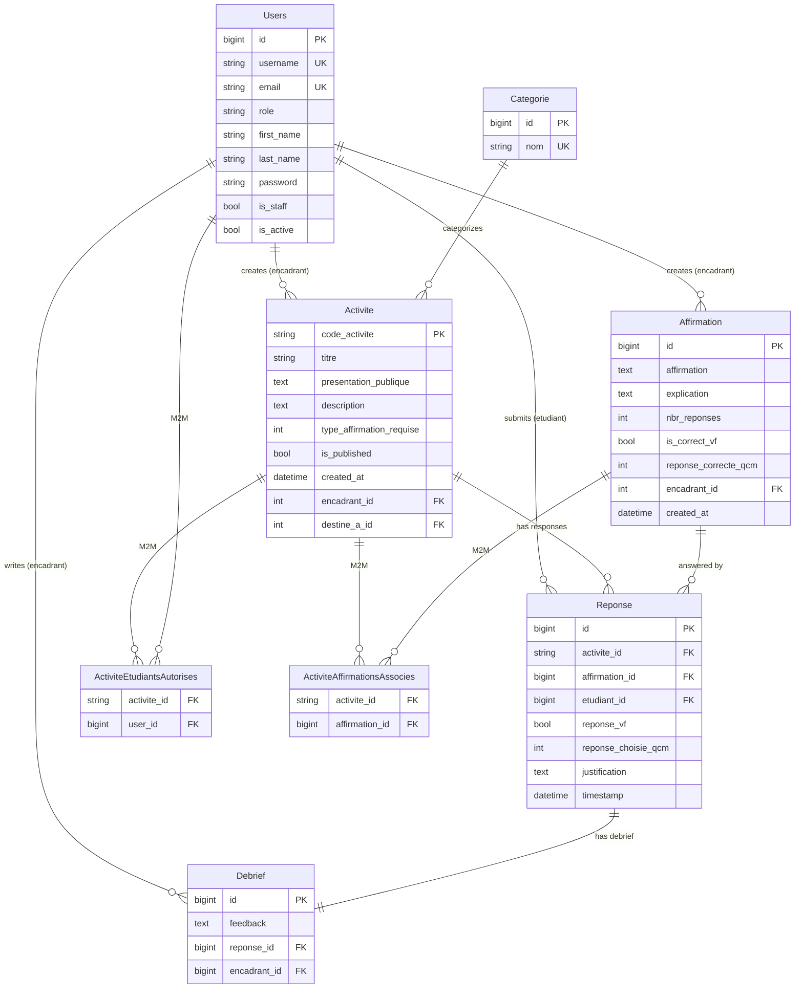

# TrAP (TroubleMaker Agent Platform) — Design Document

---

## Table of Contents

1. [Project Overview](#1-project-overview)
2. [Architecture Overview](#2-architecture-overview)
3. [Backend (Django REST API)](#3-backend-django-rest-api)
   - 3.1 [Models](#31-models)
   - 3.2 [API Endpoints](#32-api-endpoints)
   - 3.3 [Authentication & Session Management](#33-authentication--session-management)
   - 3.4 [Middleware](#34-middleware)
   - 3.5 [AI Integration (Gemini)](#35-ai-integration-gemini)
   - 3.6 [Admin & Fixtures](#36-admin--fixtures)
4. [Frontend (Next.js)](#4-frontend-nextjs)
   - 4.1 [Route Tree](#41-route-tree)
   - 4.2 [Component Inventory](#42-component-inventory)
   - 4.3 [User Flows](#43-user-flows)
   - 4.4 [API Integration](#44-api-integration)
   - 4.5 [Styling](#45-styling)
5. [Data Flow Diagrams](#5-data-flow-diagrams)
6. [Configuration & Environment](#6-configuration--environment)
7. [Database Schema](#7-database-schema)
8. [Development Setup](#8-development-setup)
9. [Key Design Decisions](#9-key-design-decisions)
10. [Known Limitations & Future Work](#10-known-limitations--future-work)

---

## 1. Project Overview

### Purpose

TrAP (TroubleMaker Agent Platform) is an academic medical quiz platform tied to a published Springer paper titled "Making Hallucinations Useful." The platform deliberately exploits LLM hallucinations as a pedagogical tool: mentors (encadrants) use the Gemini AI API to generate intentionally false-but-plausible medical affirmations, which train students' critical thinking.

### Problem Being Solved

Large language models hallucinate false medical facts with high confidence. Rather than treating this as a liability, TrAP repurposes it: the platform uses Gemini to produce medically plausible-but-wrong statements as quiz material. Students must detect the error, justify their reasoning, and then receive mentor feedback (debriefs).

### User Types

| Role | French Term | Description |
|---|---|---|
| **Mentor** | `encadrant` | Creates activities, generates affirmations via AI, configures quizzes, reviews student answers, writes debriefs |
| **Student** | `etudiant` | Logs in with email + activity code, answers affirmations (VF or 4-choice), reviews their feedback |
| **Admin** | — | Django superuser with access to `/admin/`; manages all models directly |

### Core Concepts

- **Activite** — a named quiz session with a unique uppercase code (e.g., `CARD1`), linked to a category, a list of authorized students, and a set of affirmations. Must be published (`is_published=True`) before students can access it.
- **Affirmation** — a medical statement that is false-but-plausible. Can be VF (true/false, `nbr_reponses=2`) or QCM (4 choices, `nbr_reponses=4`). Correctness answer is optional — affirmations may be "neutral."
- **Reponse** — a student's answer to one affirmation in one activity. Upserted (one per unique `activite × affirmation × etudiant` triple).
- **Debrief** — a one-to-one mentor feedback text attached to a single student response.

---

## 2. Architecture Overview

### High-Level Diagram (ASCII)

```
Browser
  |
  |  HTTP (same origin)
  v
+----------------------------------------------+
|            Next.js Frontend                  |
|            (port 3000)                       |
|                                              |
|  /encadrant/*  (mentor pages)                |
|  /etudiant/*   (student pages)               |
|                                              |
|  /api/[...path]/route.ts                     |
|  (catch-all server-side proxy)               |
+----------------------------------------------+
  |
  |  HTTP  (server-to-server, API_BACKEND_URL)
  |  Forwards cookies, strips host header
  v
+----------------------------------------------+
|            Django Backend                    |
|            (port 8000)                       |
|                                              |
|  SessionAuthentication (no JWT)              |
|  DisableCSRF middleware                      |
|                                              |
|  /api/*   (DRF views)                        |
|  /admin/  (Django admin)                     |
+----------------------------------------------+
  |
  |  Python SDK (google-generativeai)
  v
+--------------------+       +----------------+
|   Gemini API       |       |   SQLite DB    |
|   (Google AI)      |       |   (db.sqlite3) |
+--------------------+       +----------------+
```

### Proxy Architecture

The browser never calls the Django backend directly. All `/api/*` requests from the browser go to Next.js, which forwards them server-to-server to Django. This solves the `SameSite` session cookie problem that arises when the frontend and backend run on different origins — the cookie is stored against the Next.js origin and forwarded transparently.

### Tech Stack Versions

| Layer | Technology | Version |
|---|---|---|
| Backend framework | Django | 5.1.2 |
| REST API | Django REST Framework | 3.15.2 |
| CORS | django-cors-headers | 4.5.0 |
| Static files | WhiteNoise | 6.6.0 |
| Env loading | python-dotenv | (unpinned) |
| AI SDK | google-generativeai | 0.7.2 |
| DB | SQLite | (bundled with Python) |
| Frontend framework | Next.js (App Router) | 15.0.3 |
| UI library | React | 18.2.0 |
| Language (frontend) | TypeScript | 5 |
| HTTP client | axios | 1.7.8 |
| Table | TanStack React Table | 8.20.6 |
| CSS framework | Tailwind CSS | 3.4.1 |
| UI primitives | Radix UI (via shadcn/ui) | various |
| Icons | lucide-react | 0.464.0 |
| Dev bundler | Turbopack (Next.js built-in) | — |

---

## 3. Backend (Django REST API)

### 3.1 Models

The backend lives in `backend/api/models.py`. All models call `full_clean()` in `save()`, meaning model-level validation (including custom `clean()` methods) runs on every write. The custom user model is referenced via `settings.AUTH_USER_MODEL = 'api.Users'`.

#### `Users` (extends `AbstractUser`)

Replaces `auth.User`. `USERNAME_FIELD` remains `username`; email is additionally required and unique.

| Field | Type | Constraints |
|---|---|---|
| `username` | CharField (inherited) | Unique; `USERNAME_FIELD` |
| `email` | EmailField | `unique=True`, not blank, not null |
| `role` | CharField(50) | choices: `etudiant` / `encadrant`; default `etudiant` |
| `first_name`, `last_name` | CharField (inherited) | Optional |
| `is_staff`, `is_active`, etc. | (inherited) | AbstractUser defaults |
| `password` | (inherited) | Not set for auto-created students |

- `REQUIRED_FIELDS = ['role']`
- `__str__` returns `email or username`

#### `Categorie`

Lookup table for quiz subject areas.

| Field | Type | Constraints |
|---|---|---|
| `id` | BigAutoField | PK, auto-increment |
| `nom` | CharField(100) | `unique=True` |

#### `Activite`

A quiz session. The primary key is a user-defined string code.

| Field | Type | Constraints / Notes |
|---|---|---|
| `code_activite` | CharField(9) | **Primary key**; regex validator `^[A-Z0-9]{1,9}$`; forced uppercase in `clean()` |
| `titre` | CharField(255) | Required |
| `presentation_publique` | TextField | `blank=True, null=True` — shown to students before they start |
| `description` | TextField | `blank=True, null=True` — internal mentor note |
| `type_affirmation_requise` | IntegerField | choices: `2` (Vrai/Faux), `4` (4 Choix Fixes); default `2` |
| `is_published` | BooleanField | default `False`; gates student access |
| `created_at` | DateTimeField | `auto_now_add=True` |
| `encadrant` | FK → `Users` | `CASCADE`; `limit_choices_to={'role':'encadrant'}`; `related_name='activites_crees'` |
| `destine_a` | FK → `Categorie` | `SET_NULL, null=True, blank=True` |
| `etudiants_autorises` | M2M → `Users` | `limit_choices_to={'role':'etudiant'}`; `blank=True`; `related_name='activites_autorisees'` |
| `affirmations_associes` | M2M → `Affirmation` | `blank=True`; `related_name='activites'` |

- Property `nbr_affirmations_associe`: count of linked affirmations (used in admin list).
- `save()` calls `full_clean()`, enforcing the regex validator on every write.

#### `Affirmation`

A medical statement that is false-but-plausible.

| Field | Type | Constraints / Notes |
|---|---|---|
| `id` | BigAutoField | PK |
| `affirmation` | TextField | Required; the statement text |
| `explication` | TextField | `blank=True, null=True` — explanation of why it is false |
| `nbr_reponses` | IntegerField | choices: `2` (VF) or `4` (4-choice); validated in `clean()` |
| `is_correct_vf` | BooleanField | `null=True, blank=True` — optional correctness flag; affirmations are neutral by default |
| `reponse_correcte_qcm` | IntegerField | choices 1–4; `null=True, blank=True` — optional |
| `encadrant` | FK → `Users` | `SET_NULL, null=True, blank=True`; `related_name='affirmations_creees'` |
| `created_at` | DateTimeField | `auto_now_add=True, null=True` |

- `clean()` validates `nbr_reponses` is 2 or 4; `is_correct_vf` and `reponse_correcte_qcm` are always optional.
- `save()` calls `full_clean()`.

#### `Reponse`

A student's answer to one affirmation in one activity.

| Field | Type | Constraints / Notes |
|---|---|---|
| `id` | BigAutoField | PK |
| `activite` | FK → `Activite` | `CASCADE` |
| `affirmation` | FK → `Affirmation` | `CASCADE` |
| `etudiant` | FK → `Users` | `CASCADE`; `limit_choices_to={'role':'etudiant'}` |
| `reponse_vf` | BooleanField | `null=True, blank=True` — for VF affirmations |
| `reponse_choisie_qcm` | IntegerField | choices 1–4; `null=True, blank=True` — for 4-choice |
| `justification` | TextField | `blank=True, null=True` |
| `timestamp` | DateTimeField | `auto_now_add=True` |

- `Meta.unique_together = ('activite', 'affirmation', 'etudiant')` — one response per student per affirmation per activity.
- `clean()`: mutually exclusive answer fields — if `nbr_reponses==2`, clears `reponse_choisie_qcm`; if `nbr_reponses==4`, clears `reponse_vf`.
- `save()` calls `full_clean()`.

#### `Debrief`

One-to-one mentor feedback attached to a student response.

| Field | Type | Constraints / Notes |
|---|---|---|
| `id` | BigAutoField | PK |
| `feedback` | TextField | Required |
| `reponse` | OneToOneField → `Reponse` | `CASCADE` — one debrief per response |
| `encadrant` | FK → `Users` | `CASCADE`; `limit_choices_to={'role':'encadrant'}` |

---

### 3.2 API Endpoints

All endpoints are mounted under `/api/` (defined in `config/urls.py` → includes `api/urls.py`).

#### Authentication

| Method | Path | Auth Required | Description |
|---|---|---|---|
| POST | `/api/login/encadrant/` | No | Encadrant login; body: `{ email, password }`; sets `sessionid` cookie |
| POST | `/api/encadrant/login/` | No | Legacy alias for encadrant login (same view, second URL registration) |
| POST | `/api/login/activite/` | No | Student login; body: `{ email, code_activite }`; no password check; validates M2M membership and `is_published` |
| POST | `/api/logout/` | Yes (IsAuthenticated) | Destroys session |

**Note on dual login paths:** The frontend `encadrant/login` page POSTs to `/api/encadrant/login` (the legacy alias), not `/api/login/encadrant/` (the canonical path documented in CLAUDE.md). Both routes point to the same view; both work.

**Student login detail:** `ActiviteLoginView` finds the user by `email` + `role='etudiant'`, checks `etudiants_autorises` M2M and `is_published=True`, then calls Django's `login()` via `ModelBackend` without checking the password. Students have no password by default (auto-created accounts).

#### Activities

`ActiviteAPIView` handles all activity operations.

| Method | Path | Auth | Role / Access | Notes |
|---|---|---|---|---|
| GET | `/api/activites/` | Yes | encadrant: own activities; etudiant: published + authorized only | |
| GET | `/api/activites/<code>/` | Yes | encadrant: own (any status); etudiant: published + authorized only | `<code>` is string PK, forced uppercase |
| POST | `/api/activites/` | Yes | encadrant only | Body: `{ titre, code_activite, presentation_publique, description, type_affirmation_requise, destine_a_id, affirmations_associes_ids, etudiants_autorises_ids }` or `etudiants_emails` (comma-separated string, auto-creates missing student accounts) |
| PUT | `/api/activites/<code>/` | Yes | encadrant owner only | Full update; M2M via `etudiants_autorises_ids` and `affirmations_associes_ids` popped from body |
| PATCH | `/api/activites/<code>/` | Yes | encadrant owner only | Partial update; same M2M handling as PUT |
| DELETE | `/api/activites/<code>/` | Yes | encadrant owner only | Cascades to associated responses and debriefs |

**Response shape (GET list/detail — encadrant):**
```json
{
  "code_activite": "CARD1",
  "titre": "Quiz Cardiologie de Base",
  "presentation_publique": "...",
  "description": "...",
  "type_affirmation_requise": 2,
  "is_published": false,
  "created_at": "2024-01-01T00:00:00Z",
  "encadrant": { "id": 1, "email": "prof@example.com", "username": "...", "role": "encadrant" },
  "destine_a": { "id": 1, "nom": "Cardiologie" },
  "etudiants_autorises": [ { "id": 2, "email": "student@example.com" } ],
  "affirmations_associes": [ { "id": 1, "affirmation": "...", "nbr_reponses": 2, ... } ],
  "nbr_affirmations_associe": 3
}
```

**Write request body (POST/PATCH):**
```json
{
  "titre": "Quiz Cardiologie",
  "code_activite": "CARD1",
  "type_affirmation_requise": 2,
  "is_published": false,
  "destine_a_id": 1,
  "affirmations_associes_ids": [1, 2, 3],
  "etudiants_autorises_ids": [2, 3],
  "etudiants_emails": "alice@example.com, bob@example.com"
}
```

#### Affirmations

`AffirmationAPIView` handles affirmation operations.

| Method | Path | Auth | Role / Access | Notes |
|---|---|---|---|---|
| GET | `/api/affirmations/` | Yes | encadrant only | Returns ALL affirmations (not filtered by creator) |
| GET | `/api/affirmations/<id>/` | Yes | encadrant only | Any affirmation by PK |
| POST | `/api/affirmations/` | Yes | encadrant only | Body includes optional `activity_code` to link immediately; `encadrant` auto-set to `request.user` |
| PUT | `/api/affirmations/<id>/` | Yes | encadrant who owns an activity linked to this affirmation | Uses `partial=True` (behaves as PATCH) |
| DELETE | `/api/affirmations/<id>/` | Yes | encadrant who owns an activity linked to this affirmation | Removes from all linked activities; does not delete the object |

**Permission oddity:** PUT/DELETE checks `affirmation.activites.filter(encadrant=request.user).exists()` — not `affirmation.encadrant == request.user`. Any encadrant who has this affirmation in one of their activities can edit or delete it, even if another encadrant created it.

**Response shape (GET):**
```json
{
  "id": 1,
  "affirmation": "Le coeur possède quatre ventricules distincts.",
  "explication": "Le coeur ne possède que deux ventricules.",
  "nbr_reponses": 2,
  "is_correct_vf": false,
  "reponse_correcte_qcm": null,
  "created_at": "2024-01-01T00:00:00Z",
  "activites_codes": ["CARD1"]
}
```

#### Student Responses

`ReponseAPIView` handles response upserts.

| Method | Path | Auth | Role / Access | Notes |
|---|---|---|---|---|
| GET | `/api/reponses/` | Yes | etudiant: own responses (filterable by `?activity_code=` and `?affirmation_id=`); encadrant: requires `?activity_code=` (must own activity) | |
| GET | `/api/reponses/<id>/` | Yes | etudiant: own; encadrant: within owned activity | |
| POST | `/api/reponses/` | Yes | etudiant only | **Upsert** via `update_or_create` on `(activite, affirmation, etudiant)`; validates student authorized + affirmation in activity; returns 201 if created, 200 if updated |
| PUT | `/api/reponses/<id>/` | Yes | etudiant only (own response) | Partial update; FK fields (`activite`, `affirmation`, `etudiant`) stripped from body |
| DELETE | `/api/reponses/<id>/` | Yes | any | Always returns **405 Method Not Allowed** |

**POST body (upsert):**
```json
{
  "activite": "CARD1",
  "affirmation": 1,
  "reponse_vf": false,
  "reponse_choisie_qcm": null,
  "justification": "The heart has only two ventricles."
}
```

**GET response shape (nested):**
```json
{
  "id": 1,
  "etudiant": { "id": 2, "email": "student@example.com", "username": "...", "role": "etudiant" },
  "activite": { "code_activite": "CARD1", "titre": "...", ... },
  "affirmation": { "id": 1, "affirmation": "...", "nbr_reponses": 2, ... },
  "reponse_vf": false,
  "reponse_choisie_qcm": null,
  "justification": "...",
  "timestamp": "2024-01-01T00:00:00Z"
}
```

#### Debriefs

`DebriefAPIView` handles mentor feedback on student responses.

| Method | Path | Auth | Role / Access | Notes |
|---|---|---|---|---|
| GET | `/api/debriefs/` | Yes | encadrant: own debriefs; etudiant: debriefs for own responses (filterable by `?activity_code=`) | |
| GET | `/api/debriefs/<id>/` | Yes | encadrant only (own) | |
| POST | `/api/debriefs/` | Yes | encadrant only | Body: `{ reponse_id, feedback }`; checks encadrant owns the activity; returns 409 if debrief already exists for that response |
| PUT | `/api/debriefs/<id>/` | Yes | encadrant owner only | Partial update; `reponse` and `encadrant` fields stripped from body |
| DELETE | `/api/debriefs/<id>/` | Yes | encadrant owner only | |

**POST body:**
```json
{
  "reponse_id": 2,
  "feedback": "L'artère pulmonaire est une exception notable — elle transporte du sang désoxygéné."
}
```

**GET response shape:**
```json
{
  "id": 1,
  "feedback": "...",
  "encadrant": 1,
  "reponse": {
    "id": 2,
    "etudiant": { ... },
    "activite": { ... },
    "affirmation": { ... },
    "reponse_vf": true,
    "justification": "...",
    "timestamp": "..."
  }
}
```

#### Gemini AI Generation

| Method | Path | Auth | Description |
|---|---|---|---|
| POST | `/api/gemini/generate-affirmations/` | Yes (IsAuthenticated) | Generates exactly 3 false medical affirmations for a given `question` |
| POST | `/api/gemini/make-harder/` | Yes (IsAuthenticated) | Reformulates one affirmation to be subtler and harder to detect as false |
| POST | `/api/chatbot/` | Yes (IsAuthenticated) | Legacy version of generate-affirmations (no strict 3-item count check) |
| POST | `/api/generate/` | Yes (IsAuthenticated) | Wrapper around `chatbot/`; requires `number` (int) and `question` fields |

**Note on unregistered views:** `GeminiMakeSingleAffirmationHarderAPIView` and `GeminiMakeMultipleAffirmationsHarderAPIView` are defined in `views.py` but are not registered in `api/urls.py` — they are unreachable via HTTP.

#### User & Category Utilities

| Method | Path | Auth | Role | Notes |
|---|---|---|---|---|
| POST | `/api/users/get_ids_by_email/` | Yes | encadrant only | Body: `{ "emails": ["a@b.com", ...] }`; response: `{ ids, found_count, requested_count, missing_emails }` |
| GET | `/api/categories/` | Yes | encadrant only | Lists all categories ordered by name |
| POST | `/api/categories/` | Yes | encadrant only | Body: `{ "nom": "Cardiologie" }` |

#### Other Registered URLs

| Path | Description |
|---|---|
| `/api-auth/` | DRF browsable API login/logout |
| `/admin/` | Django admin |

---

### 3.3 Authentication & Session Management

**Mechanism:** Django session-based authentication only. `SessionAuthentication` is the sole entry in DRF's `DEFAULT_AUTHENTICATION_CLASSES`. `TokenAuthentication` is present but commented out in `settings.py`.

**Session lifecycle:**
1. Client POSTs credentials to login endpoint.
2. Django calls `login(request, user)` which creates a server-side session and returns a `Set-Cookie: sessionid=...` header.
3. The browser stores the `sessionid` cookie against the Next.js origin (same-origin due to proxy).
4. All subsequent requests include the `sessionid` cookie, which Django resolves to the authenticated user.

**Cookie settings:**
- `SESSION_COOKIE_SAMESITE = 'Lax'`
- `SESSION_COOKIE_SECURE = False` (HTTP in development; must be `True` in production HTTPS)
- `SESSION_COOKIE_HTTPONLY` — defaults to `True` (not overridden)

**Passwordless student login:** `ActiviteLoginView` performs a lookup by email (`Users.objects.get(email=email, role='etudiant')`), validates M2M membership and `is_published`, then calls `login(request, user, backend='django.contrib.auth.backends.ModelBackend')` — no `authenticate()` call, no password check.

**Per-view permissions:** Each view class declares its own `permission_classes`. There is no global `DEFAULT_PERMISSION_CLASSES` in DRF settings. Most views require `IsAuthenticated`; some add custom role checks inline.

---

### 3.4 Middleware

The MIDDLEWARE stack in `config/settings.py`, in order:

| Position | Middleware | Source | Purpose |
|---|---|---|---|
| 1 | `SecurityMiddleware` | Django | HTTP security headers, HTTPS redirect |
| 2 | `SessionMiddleware` | Django | Session cookie processing |
| 3 | `CorsMiddleware` | django-cors-headers | CORS preflight and headers |
| 4 | `CommonMiddleware` | Django | URL trailing slash, content type |
| 5 | `DisableCSRF` | `middleware/disable_csrf.py` (custom) | Sets `request._dont_enforce_csrf_checks = True` on every request; globally bypasses CSRF |
| 6 | `AuthenticationMiddleware` | Django | Attaches `request.user` from session |
| 7 | `MessageMiddleware` | Django | Flash messages |
| 8 | `XFrameOptionsMiddleware` | Django | `X-Frame-Options` header |
| 9 | `WhiteNoiseMiddleware` | whitenoise | Serves compressed static files |

**Notes:**
- `CsrfViewMiddleware` is commented out — replaced entirely by `DisableCSRF`.
- `DisableCSRF` is located at `backend/middleware/disable_csrf.py` (not `backend/api/middleware/`).
- The `WhiteNoiseMiddleware` position (after auth) is standard for API-first Django apps.
- CSRF bypass is global and intentional — the API is designed for session-based calls from the same-origin proxy, and CORS + SameSite provide sufficient cross-origin protection for the use case.

---

### 3.5 AI Integration (Gemini)

#### Import Guard

At module load time in `api/views.py`, `google.generativeai` is imported inside a `try/except`. If the import fails:
- A `MockGenAI` class hierarchy is constructed (`MockGenAI`, `MockGenerativeModel`, `MockResponse`).
- `genai` is set to the mock.
- `GENAI_AVAILABLE = False`.
- `MockGenerativeModel.generate_content()` returns: `"Google Generative AI is not available due to compatibility issues."`

If the import succeeds:
- `API_KEY = os.environ.get("GEMINI_API_KEY")` is read at module load.
- If set, `genai.configure(api_key=API_KEY)` is called immediately.

#### Error Fallback Strategy

All Gemini views share a layered fallback. If any of the following strings appear in the caught exception message, a hardcoded mock response is returned instead of raising an error:

| Error Trigger | Cause |
|---|---|
| `SERVICE_DISABLED` | Google AI API disabled for the project (403 variant) |
| `"403"` in error string | Forbidden (billing, service not enabled) |
| `"404"` in error string | Model not found (name mismatch) |
| `"429"` in error string | Quota exhausted (rate limit) |

This means the platform can always return something to users even without a valid API key or quota.

#### `extract_json_from_gemini` Helper

Shared utility that:
1. Strips markdown code fences (` ```json ` and ` ``` `).
2. Tries `json.loads()`.
3. On failure, applies regex `r"(\[.*\]|\{.*\})"` with `re.DOTALL` to find the first JSON structure.

#### View 1: `GeminiGenerateAffirmationsAPIView` (POST `/api/gemini/generate-affirmations/`)

| Attribute | Value |
|---|---|
| Model | `gemini-1.5-flash` |
| Generation config | `temperature=0.9`, `top_p=0.95`, `top_k=40`, `max_output_tokens=8192`, `response_mime_type="text/plain"` |
| Input | `{ "question": "string" }` |
| Output | `{ "affirmations": [{ "affirmation": "...", "is_correct_vf": false, "explication": "..." }, ...] }` |

**Prompt (French, paraphrased):** Instructs Gemini to produce exactly 3 false but medically plausible affirmations related to the question. Requires a JSON response with key `"affirmations"` containing 3 objects with keys `affirmation`, `is_correct_vf` (always false), `explication`.

**Post-processing:**
- Validates exactly 3 items in the list.
- Forces `is_correct_vf = False` on all items regardless of Gemini's value.

**Mock fallback response:** 3 hardcoded false affirmations about statins/hepatotoxicity (HMG-CoA reductase, CYP3A4, SLCO1B1 themes). These are fixed strings unrelated to the user's question.

#### View 2: `GeminiMakeHarderAPIView` (POST `/api/gemini/make-harder/`)

| Attribute | Value |
|---|---|
| Model | `gemini-2.5-flash-preview-04-17` |
| Generation config | Default (none specified) |
| Input | `{ "affirmation": "...", "explanation": "..." }` |
| Output | `{ "affirmation": "...", "explanation": "..." }` |

**Per-request reconfiguration:** This view re-calls `genai.configure(api_key=os.environ.get("GEMINI_API_KEY"))` on each POST — a minor redundancy.

**Prompt (French, paraphrased):** Instructs Gemini as a medical expert to reformulate the affirmation to be more plausible, more technical, subtler, and harder to detect as false, while preserving the fundamental reason it is false. Expects a text response with prefix lines `"Affirmation améliorée : "` and `"Explication améliorée : "`.

**Parsing:** Uses `re.search` with `re.DOTALL` to extract values after the prefix lines. Falls back to original values if regex fails.

**Mock fallback:** Appends `", selon les dernières méta-analyses issues de cohortes prospectives multicentriques."` to the original affirmation; appends a note about false scientific authority to the explanation.

#### View 3: `GeminiMakeSingleAffirmationHarderAPIView` (UNREGISTERED)

| Attribute | Value |
|---|---|
| Model | `gemini-1.5-flash` |
| Input | `{ "affirmation": "..." }` |
| Status | Defined but not registered in `api/urls.py` — HTTP unreachable |

Returns only the reformulated affirmation text (no JSON, no explanation). Validates response length >= 10 chars and absence of `"désolé"`.

#### View 4: `GeminiMakeMultipleAffirmationsHarderAPIView` (UNREGISTERED)

| Attribute | Value |
|---|---|
| Model | `gemini-1.5-flash` |
| Input | `{ "statements": [...], "question": "...", "field": "médecine" }` |
| Status | Defined but not registered in `api/urls.py` — HTTP unreachable |

Batch-reformulates a list of false affirmations, returns `{"statements": [...]}`.

#### Legacy: `ChatbotAPIView` / `GenerateAPIView`

- `ChatbotAPIView` (`/api/chatbot/`): Same model/config/prompt as `GeminiGenerateAffirmationsAPIView` but without the strict 3-item count check.
- `GenerateAPIView` (`/api/generate/`): Wraps `ChatbotAPIView` with additional `number`/`question` validation and simulates an internal DRF Request to delegate.

#### Gemini Model History

The model used for generation has changed several times:

| Commit | Change |
|---|---|
| Earlier development | `gemini-1.5-flash` |
| `fdbb4b7` | Upgraded to `gemini-2.0-flash` |
| `7a3993e` (latest) | Reverted to `gemini-1.5-flash` (to fix 404 model errors) |

`GeminiMakeHarderAPIView` continues to use `gemini-2.5-flash-preview-04-17` (a newer preview model than the generate view).

---

### 3.6 Admin & Fixtures

#### Admin Registration (`api/admin.py`)

All six models are registered with custom admin classes:

| Model | Admin Class | Key Features |
|---|---|---|
| `Categorie` | `CategorieAdmin` | `list_display`: id, nom; `search_fields`: nom |
| `Activite` | `ActiviteAdmin` | `list_display`: code, titre, encadrant, destine_a, affirmation count, created_at; `TabularInline` for both M2M relations; `autocomplete_fields` for destine_a and encadrant |
| `Affirmation` | `AffirmationAdmin` | Sectioned fieldsets with collapsible VF section and collapsible QCM section; filter by nbr_reponses |
| `Reponse` | `ReponseAdmin` | Shows etudiant, activite, affirmation, both answer types, timestamp; `readonly_fields=(timestamp,)` |
| `Debrief` | `DebriefAdmin` | Shows encadrant, reponse, feedback; autocomplete for reponse and encadrant |
| `Users` | `UsersAdmin` | Extends `BaseUserAdmin`; custom creation form adds email, first_name, last_name, role; 'role' field appended to 'Permissions' fieldset |

**Known debug artifact:** `UsersAdmin.add_view` and `UsersCreationForm.save()` contain uncommitted `print()` debug logging that was not cleaned up.

#### Fixtures (`api/fixtures/initial_data.json`)

Provides seed data for development. Assumes users with pk=1 (encadrant), pk=2 (etudiant), pk=3 (etudiant) already exist (created separately via `createsuperuser` or a users fixture).

| Model | Records |
|---|---|
| `api.categorie` | pk=1: "Cardiologie"; pk=2: "Premiers Secours" |
| `api.affirmation` | 4 records: 2 VF-type (pk=1,2), 2 QCM-type (pk=3,4); all medically false statements |
| `api.activite` | pk="CARD1": cardiologie quiz (etudiants=[2,3], affirmations=[1,2,3]); pk="SECU1": premiers secours quiz (etudiants=[2], affirmations=[4]) |
| `api.reponse` | 5 responses from students 2 and 3 across both activities |
| `api.debrief` | 2 debriefs (encadrant=1) for responses 2 and 5 |

**Note:** Neither fixture activity has `is_published` set, so they default to `False` — students cannot log in until an encadrant publishes them.

Load command:
```powershell
python manage.py loaddata api/fixtures/initial_data.json
```

---

## 4. Frontend (Next.js)

### 4.1 Route Tree

All pages are `"use client"` components under `src/app/`. The App Router in Next.js 15 is used throughout.

```
src/app/
├── layout.tsx                    Root layout: Geist fonts, lang="fr", antialiased
├── page.tsx                      / — Role selector: two buttons → encadrant/login or etudiant/login
├── not-found.tsx                 /not-found — Custom 404, auto-redirects to / after 2s
│
├── api/
│   └── [...path]/
│       └── route.ts             /api/* — Catch-all proxy to Django backend (API_BACKEND_URL)
│
├── encadrant/
│   ├── layout.tsx               Auth guard: probes GET /api/activites; redirects to /encadrant/login on failure
│   ├── login/
│   │   └── page.tsx             /encadrant/login — Email + password login form
│   ├── liste_activite/
│   │   └── page.tsx             /encadrant/liste_activite — Main dashboard; lists all activities
│   ├── creer_activite/
│   │   └── page.tsx             /encadrant/creer_activite — Activity creation form (~1330 lines)
│   ├── parametres_activite/
│   │   └── page.tsx             /encadrant/parametres_activite?code= — Activity edit/settings
│   ├── generer/
│   │   └── page.tsx             /encadrant/generer?activity_code= — AI affirmation generator
│   ├── debrief/
│   │   └── page.tsx             /encadrant/debrief?activity_code= — Student response review + debrief writing
│   └── liste_affirmations/
│       └── page.tsx             /encadrant/liste_affirmations — Affirmation list (edit stub, incomplete)
│
└── etudiant/
    ├── login/
    │   └── page.tsx             /etudiant/login — Email + activity code login
    └── activite/
        ├── page.tsx             /etudiant/activite?code= — Activity presentation
        ├── feedback/
        │   └── page.tsx         /etudiant/activite/feedback?code= — View mentor debriefs
        └── participer/
            ├── page.tsx         /etudiant/activite/participer?code= — Main participation (one affirmation at a time)
            └── confirmer/
                └── page.tsx     /etudiant/activite/participer/confirmer?code= — Read-only answer review
```

**Note on student feedback route:** The feedback page is at `src/app/etudiant/activite/feedback/page.tsx` (sibling of `participer/`), accessible at `/etudiant/activite/feedback?code=`.

**No server-side or middleware-level route protection exists.** Unauthenticated users can navigate to any route. The Django backend returns 403, and the page displays an inline error message but does not redirect.

---

### 4.2 Component Inventory

#### Domain Components (`src/components/`)

| Component | File | Status | Purpose |
|---|---|---|---|
| `AffirmationCard` | `AffirmationCard.tsx` | **Defined but unused** | Reusable affirmation list item with inline edit, drag-and-drop, truth toggle, delete callbacks. Handles both `text` and `affirmation` field names. Color-coded by `is_correct_vf`. |
| `AppSidebar` | `app-sidebar.tsx` | **Defined but unused** | Fixed-left sidebar with nav links to "Liste des activités" and "Liste des affirmations". Uses `usePathname` for active highlighting. Not mounted by any layout. |

Both components were likely created for extraction/reuse but were never wired into pages. Pages instead inline their own affirmation list logic.

#### UI Primitives (`src/components/ui/`)

All are shadcn/ui wrappers around Radix UI primitives, styled with Tailwind.

| Component | Based On | Used In |
|---|---|---|
| `Account.tsx` | Custom | `liste_affirmations` (with hardcoded user name) |
| `button.tsx` | Radix Slot + CVA | `generer`, `debrief`, `participer`, `confirmer`, `feedback` |
| `card.tsx` | Custom | `generer` |
| `checkbox.tsx` | Radix Checkbox | Available, usage not confirmed |
| `command.tsx` | cmdk | Category autocomplete in `creer_activite`, `parametres_activite` |
| `dialog.tsx` | Radix Dialog | Available |
| `dropdown-menu.tsx` | Radix DropdownMenu | `generer` (per-affirmation "Supprimer" option) |
| `input.tsx` | Native input | `debrief` (search filter) |
| `label.tsx` | Radix Label | `participer` |
| `radio-group.tsx` | Radix RadioGroup | `participer` (answer selection) |
| `separator.tsx` | Radix Separator | Available |
| `sheet.tsx` | Radix Dialog (Sheet) | Available |
| `sidebar.tsx` | shadcn sidebar | **Defined but not rendered anywhere** |
| `skeleton.tsx` | Custom pulse | `confirmer`, `feedback` (loading states) |
| `table.tsx` | Native table | `debrief` (via TanStack Table) |
| `textarea.tsx` | Native textarea | `generer`, `participer`, `creer_activite` |
| `tooltip.tsx` | Radix Tooltip | Available |

---

### 4.3 User Flows

#### Mentor (Encadrant) Flow

**Step 1: Login (`/encadrant/login`)**
- Form fields: email, password (required client-side).
- `POST /api/encadrant/login` with `{ email, password }`, `withCredentials: true`.
- On HTTP 200: redirect to `/encadrant/liste_activite`.
- Errors: `err.response.data?.error` displayed inline; falls back to generic message.
- Loading state: inputs + button disabled, button shows "Connexion...".

**Step 2: View Activity List (`/encadrant/liste_activite`)**
- Fetches `GET /api/activites` on mount. Also re-fetches on `visibilitychange` and `window.focus` events.
- User email derived from `response.data[0].encadrant.email` (no dedicated `/me` endpoint).
- Per-activity card shows: title, `code_activite`, publish status, type (V/F or 4CH), description with "Voir plus/moins" toggle, affirmation count, authorized student count.
- Per-card actions: settings icon → `/encadrant/parametres_activite?code=<code>`; debrief icon → `/encadrant/debrief?activity_code=<code>`.
- List-level actions: refresh button, new activity button (`/encadrant/creer_activite`), logout (`POST /api/logout` then redirect to `/`).

**Step 3: Create Activity (`/encadrant/creer_activite`)**
- All form state is persisted to `localStorage` under key `'activity-form-data'` via the `usePersistedFormState` hook. On mount, saved data is restored with a dismissible "Données restaurées!" banner.
- Form fields: learner type (radio: interne/externe), formation/category (searchable combobox with new-category creation), activity title, activity code (max 8 chars, alphanumeric uppercase), response type (radio: 2 or 4), feedback type (radio: manuel/automatique), authorized emails (textarea, comma-separated), public presentation (textarea), description (textarea).
- Dual-panel affirmation selection: left = "Affirmations sélectionnées", right = "Base de données" (fetched from `GET /api/affirmations`, excludes already-selected). Drag-and-drop between panels. Text search filters the DB panel.
- Per-affirmation actions: inline edit (PUT `/api/affirmations/:id`), truth toggle (PUT), delete (DELETE).
- "Générer" button navigates to `/encadrant/generer?activity_code=<code>` (requires code to be filled first).
- On submit: validates title, code (regex), formation; optionally creates new category; POSTs to `/api/activites`; on 201, clears localStorage and redirects to `/encadrant/liste_activite`.

**Step 4: Edit Activity (`/encadrant/parametres_activite?code=<code>`)**
- On mount: GETs activity by code, all categories, all affirmations.
- Maps `affirmations_associes[*].affirmation` (API field) to internal field `text`.
- Extracts student emails from `etudiants_autorises` array.
- Same dual-panel affirmation UI as `creer_activite`.
- Save: resolves student emails to IDs via `POST /api/users/get_ids_by_email`; then PATCHes `/api/activites/<CODE>`.
- Publish/unpublish: toggle flips `is_published` and includes it in the PATCH body.
- "Lancer l'activité" button sets `is_published: true` in the PATCH; "Retirer la publication" sets `false`.
- Delete activity: `DELETE /api/activites/<CODE>`, then redirect to list.
- Category creation: `POST /api/categories` for new names.

**Step 5: Generate Affirmations with AI (`/encadrant/generer?activity_code=<code>`)**
- Requires `activity_code` query param; shows error card if missing.
- User types a medical question and clicks "Générer": `POST /api/gemini/generate-affirmations { question }`.
- Returns 3 false affirmations with explanations; all assigned `nbr_reponses: 2` and `is_correct_vf: false` client-side.
- Per-affirmation actions:
  - Inline edit (local only, no API until save).
  - "Renforcer" → `POST /api/gemini/make-harder { affirmation, explanation }` → updates affirmation in place.
  - "Sauvegarder DB" → `POST /api/affirmations { affirmation, explication, nbr_reponses: 2, is_correct_vf: false, activity_code }` → shows green "Sauvegardé".
  - Delete (local only).
- Toggle explanation visibility per card.

**Step 6: Debrief Students (`/encadrant/debrief?activity_code=<code>`)**
- On mount: 3 parallel calls — `GET /api/activites/<code>`, `GET /api/reponses/?activity_code=<code>`, `GET /api/debriefs` (scoped to encadrant).
- Groups responses by student into `StudentResponseGroup[]`.
- TanStack Table with email column, name column, expand chevron. Email column filter via search input. Pagination.
- Expanded row: per-affirmation response + debrief input. `formatResponseText` handles the VF↔QCM cross-display mapping (4 combinations of `affirmation.nbr_reponses` × `activite.type_affirmation_requise`).
- If debrief exists → shows text (read-only); else → textarea + save button.
- Create debrief: `POST /api/debriefs { reponse_id, feedback }` → updates local `debriefs` Map.

**Step 7: Affirmation List (`/encadrant/liste_affirmations`) — Incomplete**
- Uses the `api` axios instance. Fetches `GET /api/affirmations`. Text search. Delete via `DELETE /api/affirmations/:id`.
- Edit handler (`handleEditAffirmation`) is a no-op stub: `(_id: number) => {}`.
- User info is hardcoded as "Jean Dupont". This page is incomplete/legacy.

---

#### Student (Etudiant) Flow

**Step 1: Login (`/etudiant/login`)**
- Form: email (type=email) + `code_activite` (auto-uppercased on change).
- `POST /api/login/activite { email, code_activite }`, `withCredentials: true`.
- On HTTP 200: `router.push('/etudiant/activite?code=<CODE>')`.
- Errors displayed inline.

**Step 2: Activity Presentation (`/etudiant/activite?code=CODE`)**
- `GET /api/activites/<code>` on mount.
- Shows `presentation_publique` (or a hardcoded fallback description).
- Warning: red box if `is_published === false`; yellow box if no affirmations.
- "Commencer l'activité" validates both conditions client-side, then routes to `/etudiant/activite/participer?code=<CODE>`.
- 403 with "pas encore publiée" in message shows specific text; generic 403 shows auth error; 404 shows not-found.

**Step 3: Participate (`/etudiant/activite/participer?code=CODE`)**
- Fetches activity + existing responses in sequence on mount.
- One affirmation at a time; progress bar ("Affirmation N sur Total").
- Response options driven by `activite.type_affirmation_requise`:
  - `2` → radio: "Vrai" / "Faux" / "Je ne sais pas"
  - `4` → radio: "Toujours vrai" / "Généralement vrai" / "Généralement faux" / "Toujours faux" / "Je ne sais pas"
- Free-text `Textarea` for justification.
- Navigation: Précédent / Suivant call `submitCurrentResponse()` before moving. On last affirmation, "Terminer l'activité" replaces "Suivant".
- **Auto-save (`submitCurrentResponse`):** Maps local selection to API payload using `mapLocalToApiResponse` (handles cross-mapping between `affirmation.nbr_reponses` and `activite.type_affirmation_requise`). POSTs to `/api/reponses` (upsert). Skips call if no change detected.
- **Final submit (`handleFinalSubmit`):** Saves current affirmation, then verifies every `submittedResponses[index]` has a non-null `id`. Uses `window.alert()` for missing responses. On success, routes to confirmer.

**Step 4: Confirm Answers (`/etudiant/activite/participer/confirmer?code=CODE`)**
- Fetches activity + responses in parallel (`Promise.all`).
- Read-only summary; paginates 2 affirmations per page.
- Displays stored answers with display conversion (same cross-mapping logic as participer).
- Truncates justifications > 150 chars with expand/collapse.
- Actions: "Modifier les réponses" (`router.back()`), "Voir les feedbacks" (`/etudiant/activite/feedback?code=`), "Retour à la présentation" (`/etudiant/activite?code=`).
- Uses `Skeleton` for loading; TailwindCSS for layout.

**Step 5: View Feedback (`/etudiant/activite/feedback?code=CODE`)**
- Fetches 3 endpoints in parallel: activity, student responses, `GET /api/debriefs/?activity_code=<code>`.
- Only shows affirmations where the student has a response.
- Header shows "N feedback(s) reçu(s) sur M réponse(s)".
- Per-affirmation card: student's answer (display-mapped from `affirmation.nbr_reponses` only — does not apply `type_affirmation_requise` cross-mapping, a slight inconsistency with participer/confirmer), student's justification, debrief feedback or amber "En attente" panel.
- Debrief keyed by `debrief.reponse.affirmation.id`.
- "Retour à l'activité" → `/etudiant/activite?code=<CODE>`.

---

### 4.4 API Integration

#### API Client Setup (`src/lib/api.ts`)

```typescript
// Pre-configured axios instance — used in liste_affirmations, encadrant layout
export const api = axios.create({
  baseURL: process.env.NEXT_PUBLIC_API_URL ?? "",  // empty = same-origin
  withCredentials: true,
});

// Plain string exported for manual axios calls
export const API_BASE_URL = process.env.NEXT_PUBLIC_API_URL ?? "";
```

#### Proxy Route (`src/app/api/[...path]/route.ts`)

Handles `GET`, `POST`, `PUT`, `PATCH`, `DELETE` for all `/api/*` paths:
- Reads `API_BACKEND_URL` env var (default: `http://localhost:8000`).
- Forwards the request body, all original headers except `host`.
- Strips `location` redirect response headers (prevents redirect loop).
- Sets `cache-control: no-store` on response.
- Returns the backend response body and status code verbatim.

#### HTTP Client Inconsistency (Technical Debt)

Three distinct HTTP call patterns coexist across pages:

| Pattern | Used In | Characteristics |
|---|---|---|
| Raw `axios` with explicit `API_BASE_URL` | `login`, `liste_activite`, `creer_activite`, `debrief` | `axios.post(${API_BASE_URL}/api/..., data, { withCredentials: true })` |
| Pre-configured `api` instance | `liste_affirmations`, `encadrant/layout.tsx` | `api.get('/api/...')` — base URL from env |
| Native `fetch()` | `parametres_activite`, `generer` | `fetch('/api/...', { credentials: 'include' })` |

All three effectively hit the same Next.js proxy, but the inconsistency makes auth header or base URL changes risky.

#### State Management

No global state library. All state is local `useState`/`useEffect`. Key patterns:

- `creer_activite`: `usePersistedFormState` hook — all fields backed by `localStorage`. Each field update calls both `setState` and `localStorage.setItem`. Side effect: the `useEffect(..., [selectedAffirmations])` for fetching affirmations re-runs on every selection change, causing extra `GET /api/affirmations` calls.
- `debrief`: `Map<number, Debrief>` for O(1) debrief lookup by response ID; `Record<number, string>` for textarea values.
- `generer`: `Map<number, SavedState>` for per-affirmation save status; `Set<number>` for explanation visibility.
- `debrief` + `liste_activite`: `Set<string>` for expanded rows/descriptions.
- No React Query, SWR, or Context-based data caching.

#### Auth Pattern

- Session-based. `withCredentials: true` / `credentials: 'include'` on every request.
- Encadrant auth guard: `encadrant/layout.tsx` probes `GET /api/activites` on mount. Guard renders children immediately (flash before redirect on failure).
- Student auth: no layout-level guard. Pages show inline errors on 403; none redirect to login automatically.

---

### 4.5 Styling

#### Two Coexisting Approaches

| Approach | Used In | Notes |
|---|---|---|
| **Inline `CSSProperties` objects** | `/` (root), `/etudiant/login`, `/etudiant/activite` | Defined as static objects outside/inside the component. No Tailwind. |
| **Tailwind CSS utility classes + shadcn/ui** | All `/encadrant/*` pages, `/etudiant/activite/participer`, `/etudiant/activite/participer/confirmer`, `/etudiant/activite/feedback` | Full component library usage. |

#### Tailwind Configuration (`tailwind.config.ts`)

- `darkMode: ["class"]` — dark mode via class toggle.
- Extended color palette using shadcn CSS variable tokens (`hsl(var(--background))`, `hsl(var(--foreground))`, etc.) for all semantic colors.
- `tailwindcss-animate` plugin registered.
- Content paths: `src/app/**`, `src/components/**`.

#### Fonts

Geist Sans and Geist Mono loaded as local fonts from `src/app/fonts/` via Next.js font optimization. Applied as CSS variables in the root layout. Language: `<html lang="fr">`.

---

## 5. Data Flow Diagrams

### 5.1 Mentor Creates and Publishes an Activity

```
Mentor (Browser)          Next.js Proxy             Django Backend
     |                          |                          |
     | POST /api/categories     |                          |
     | { nom: "Cardio" }        |                          |
     |------------------------->|                          |
     |                          | POST /api/categories     |
     |                          |------------------------->|
     |                          |      201 { id: 3 }       |
     |                          |<-------------------------|
     |       201 { id: 3 }      |                          |
     |<-------------------------|                          |
     |                          |                          |
     | POST /api/activites      |                          |
     | { titre, code_activite,  |                          |
     |   affirmations_associes_ids,                        |
     |   etudiants_emails, ...} |                          |
     |------------------------->|                          |
     |                          | POST /api/activites      |
     |                          |------------------------->|
     |                          |   [auto-create students] |
     |                          |   [set M2M relations]    |
     |                          |      201 { activity }    |
     |                          |<-------------------------|
     |       201 { activity }   |                          |
     |<-------------------------|                          |
     |                          |                          |
     | PATCH /api/activites/CODE|                          |
     | { is_published: true }   |                          |
     |------------------------->|                          |
     |                          | PATCH /api/activites/CODE|
     |                          |------------------------->|
     |                          |      200 { activity }    |
     |                          |<-------------------------|
     |       200 { activity }   |                          |
     |<-------------------------|                          |
```

### 5.2 Student Login and Answer Submission

```
Student (Browser)         Next.js Proxy             Django Backend
     |                          |                          |
     | POST /api/login/activite |                          |
     | { email, code_activite } |                          |
     |------------------------->|                          |
     |                          | POST /api/login/activite |
     |                          |------------------------->|
     |                          |  [find user by email]    |
     |                          |  [check M2M + published] |
     |                          |  [login() - no password] |
     |                          |  Set-Cookie: sessionid=X |
     |                          |      200 { user }        |
     |                          |<-------------------------|
     |  200 + Set-Cookie        |                          |
     |<-------------------------|                          |
     |                          |                          |
     | GET /api/activites/CODE  |                          |
     | Cookie: sessionid=X      |                          |
     |------------------------->|                          |
     |                          | GET /api/activites/CODE  |
     |                          | Cookie: sessionid=X      |
     |                          |------------------------->|
     |                          |  [SessionAuth resolves   |
     |                          |   user from sessionid]   |
     |                          |      200 { activity }    |
     |                          |<-------------------------|
     |       200 { activity }   |                          |
     |<-------------------------|                          |
     |                          |                          |
     | POST /api/reponses       |                          |
     | { activite, affirmation, |                          |
     |   reponse_vf, ... }      |                          |
     |------------------------->|                          |
     |                          | POST /api/reponses       |
     |                          |------------------------->|
     |                          |  [update_or_create on    |
     |                          |   (activite, affirmation,|
     |                          |    etudiant)]            |
     |                          |   201 or 200 { reponse } |
     |                          |<-------------------------|
     |    201/200 { reponse }   |                          |
     |<-------------------------|                          |
```

### 5.3 AI Affirmation Generation with Fallback

```
Mentor (Browser)    Next.js Proxy    Django Backend      Gemini API
     |                   |                 |                  |
     | POST /api/gemini/ |                 |                  |
     | generate-affs     |                 |                  |
     | { question }      |                 |                  |
     |------------------>|                 |                  |
     |                   | POST /api/gemini/generate-affs     |
     |                   |---------------->|                  |
     |                   |                 | generate_content |
     |                   |                 |----------------->|
     |                   |                 |                  |
     |                   |    [success path]                  |
     |                   |                 |  200 { text }    |
     |                   |                 |<-----------------|
     |                   |                 | [parse JSON]     |
     |                   |                 | [force is_correct_vf=false]
     |                   |  200 { affirmations: [...] }       |
     |                   |<----------------|                  |
     |  200 { affirmations }               |                  |
     |<------------------|                 |                  |
     |                   |                 |                  |
     |                   |    [failure path: 403/404/429]     |
     |                   |                 |  Error           |
     |                   |                 |<-----------------|
     |                   |                 | [catch + check   |
     |                   |                 |  error string]   |
     |                   |                 | [return mock     |
     |                   |                 |  statin affs]    |
     |                   |  200 { affirmations: [mock...] }   |
     |                   |<----------------|                  |
     |  200 { affirmations (mock) }        |                  |
     |<------------------|                 |                  |
```

### 5.4 Mentor Writes a Debrief

```
Mentor (Browser)         Next.js Proxy             Django Backend
     |                          |                          |
     | GET /api/reponses/       |                          |
     | ?activity_code=CARD1     |                          |
     |------------------------->|                          |
     |                          | GET /api/reponses/...    |
     |                          |------------------------->|
     |                          | [filter by activity,     |
     |                          |  check encadrant owns]   |
     |                          |      200 [reponses]      |
     |                          |<-------------------------|
     |      200 [reponses]      |                          |
     |<-------------------------|                          |
     |                          |                          |
     | POST /api/debriefs       |                          |
     | { reponse_id: 2,         |                          |
     |   feedback: "..." }      |                          |
     |------------------------->|                          |
     |                          | POST /api/debriefs       |
     |                          |------------------------->|
     |                          |  [check encadrant owns   |
     |                          |   activity of reponse]   |
     |                          |  [check no existing      |
     |                          |   debrief → else 409]    |
     |                          |      201 { debrief }     |
     |                          |<-------------------------|
     |       201 { debrief }    |                          |
     |<-------------------------|                          |
```

---

## 6. Configuration & Environment

### 6.1 Backend Environment Variables

File: `backend/.env` (copied from `backend/.env.example`).

| Variable | Required | Default | Description |
|---|---|---|---|
| `SECRET_KEY` | **Yes** | — | Django secret key. Raises `ImproperlyConfigured` at startup if missing. |
| `DEBUG` | No | `'False'` | Set to `'True'` in development. Controls debug pages, SQL logging. |
| `ALLOWED_HOSTS` | No | `'localhost,127.0.0.1'` | Comma-separated hostnames accepted by Django. Empty string is rejected at startup. |
| `GEMINI_API_KEY` | No | — | Google Gemini API key. If missing/disabled/quota exceeded, platform falls back to mock responses. |

`.env.example` contains:
```
SECRET_KEY=
DEBUG=False
ALLOWED_HOSTS=localhost,127.0.0.1
GEMINI_API_KEY=
```

### 6.2 Frontend Environment Variables

File: `frontend/.env` (not committed; no `.env.example` exists).

| Variable | Required | Default | Description |
|---|---|---|---|
| `NEXT_PUBLIC_API_URL` | No | `""` (empty string) | API base URL for browser-side axios calls. Empty = same-origin relative paths (relies on proxy). |
| `API_BACKEND_URL` | No | `http://localhost:8000` | Server-side proxy target. The Next.js route handler forwards to this URL. |

In development with default values:
- Browser axios calls go to `http://localhost:3000/api/...` (same-origin proxy).
- Proxy forwards to `http://localhost:8000/api/...` (Django).

### 6.3 Next.js Configuration (`frontend/next.config.js`)

```javascript
const nextConfig = {
  eslint: {
    ignoreDuringBuilds: true,  // ESLint errors do not fail production builds
  },
};
```

No rewrites, redirects, headers, or image domain configuration. Dev server uses Turbopack (`next dev --turbopack` in `package.json` scripts).

### 6.4 CORS Configuration

Located in `backend/config/settings.py`:

```python
CORS_ALLOW_CREDENTIALS = True

CORS_ALLOWED_ORIGINS = [
    "https://8000-cs-338772889965-default.cs-europe-west1-onse.cloudshell.dev",
    "https://3000-idx-trouble-1744103616085.cluster-4ezwrnmkojawstf2k7vqy36oe6.cloudworkstations.dev",
    "http://127.0.0.1:8000",
    "http://127.0.0.1:3000",
    "http://127.0.0.1:3001",
    "http://localhost:3000",
    "http://localhost:3001",
]

CORS_ALLOW_HEADERS = [
    "accept", "accept-encoding", "authorization", "content-type",
    "dnt", "origin", "user-agent", "x-csrftoken", "x-requested-with",
]

SESSION_COOKIE_SAMESITE = 'Lax'
SESSION_COOKIE_SECURE = False   # Must be True in production HTTPS
```

The two Google Cloud Shell/IDX URLs are hardcoded development origins indicating the project was built in cloud IDEs. These should be removed or made configurable for any deployment.

---

## 7. Database Schema

### ERD (Mermaid)



### ASCII ERD (simplified)

```
Users (api.Users)
  id [PK]
  username [UNIQUE]
  email [UNIQUE]
  role: etudiant | encadrant
        |
        |  encadrant
        +-----> Activite [code_activite PK]
        |           +--(M2M)--> Users (etudiants_autorises)
        |           +--(M2M)--> Affirmation
        |           |                |
        |           |                +---> Reponse (unique: activite+affirmation+etudiant)
        |           |                          |
        |           |                          +--(1:1)--> Debrief
        |           |
        |           +--(FK: destine_a)--> Categorie
        |
        |  encadrant
        +-----> Affirmation [id PK]
        |           nbr_reponses: 2 | 4
        |           is_correct_vf (nullable)
        |           reponse_correcte_qcm (nullable)
        |
        |  etudiant
        +-----> Reponse [id PK]
                    unique: (activite, affirmation, etudiant)
                    reponse_vf (nullable, exclusive with qcm)
                    reponse_choisie_qcm (nullable, exclusive with vf)
```

### Key Constraints Summary

| Constraint | Table | Details |
|---|---|---|
| Unique triple | `Reponse` | `(activite, affirmation, etudiant)` |
| Regex PK | `Activite` | `^[A-Z0-9]{1,9}$` |
| Mutual exclusion | `Reponse` | `reponse_vf` and `reponse_choisie_qcm` cannot both be set |
| Answer type | `Affirmation` | `nbr_reponses` must be 2 or 4 |
| One debrief per response | `Debrief` | OneToOneField on `reponse` |
| Role limits | FK fields | `limit_choices_to={'role': ...}` on FK/M2M targeting Users |

---

## 8. Development Setup

### Prerequisites

- Python 3.8+ (use `python`, not `python3`, on Windows)
- Node.js 18+ and npm
- Git

### 8.1 Backend Setup

```powershell
# Navigate to backend directory
cd backend

# Create and activate virtual environment
python -m venv .venv
.venv\Scripts\activate    # Windows PowerShell
# source .venv/bin/activate  # macOS/Linux

# Install dependencies
pip install -r requirements.txt

# Configure environment
cp .env.example .env
# Edit .env — set SECRET_KEY at minimum; add GEMINI_API_KEY if available

# Apply database migrations
python manage.py migrate

# Create a superuser (encadrant admin account)
python manage.py createsuperuser
# Follow prompts: username, email, password, role

# (Optional) Load fixture seed data
# Note: users with pk=1,2,3 must exist before loading fixtures
python manage.py loaddata api/fixtures/initial_data.json

# Start the development server
python manage.py runserver   # http://localhost:8000
```

### 8.2 Frontend Setup

```powershell
# Navigate to frontend directory
cd frontend

# Install npm dependencies
npm install

# (Optional) Configure environment
# Create frontend/.env with:
# NEXT_PUBLIC_API_URL=
# API_BACKEND_URL=http://localhost:8000

# Start development server (Turbopack)
npm run dev   # http://localhost:3000

# Other commands
npm run build    # production build
npm run lint     # ESLint (note: errors do not fail builds per next.config.js)
```

### 8.3 Running Both Servers

Both servers must run simultaneously for the application to function:

| Service | Port | Command |
|---|---|---|
| Django backend | 8000 | `python manage.py runserver` |
| Next.js frontend | 3000 | `npm run dev` |

The project includes helper scripts:
- `check_deps.ps1` / `check_deps.sh` — cross-platform dependency checker and installer.
- `devserver.sh` — activates the Python venv and starts Django. Run from `backend/`.

### 8.4 Key Development Commands

```powershell
# Backend
python manage.py makemigrations        # after model changes
python manage.py migrate               # apply migrations
python manage.py createsuperuser       # create admin user
python manage.py test api              # run backend tests
python manage.py shell                 # Django shell

# Frontend
npm run build                          # check for build errors
npm run lint                           # ESLint (non-blocking)
```

### 8.5 Accessing the Application

| URL | Description |
|---|---|
| `http://localhost:3000` | Frontend — role selector |
| `http://localhost:3000/encadrant/login` | Mentor login |
| `http://localhost:3000/etudiant/login` | Student login |
| `http://localhost:8000/admin/` | Django admin panel |
| `http://localhost:8000/api/` | DRF browsable API root |

### 8.6 Creating Test Users

After `createsuperuser`, create student accounts either:
1. Via `/admin/` → Users → Add User (set `role = etudiant`)
2. Via the `etudiants_emails` field when creating/editing an activity (auto-creates passwordless student accounts)
3. Via the Django shell:
   ```python
   from api.models import Users
   Users.objects.create_user(username='alice', email='alice@example.com', role='etudiant')
   ```

---

## 9. Key Design Decisions

### 9.1 Session Authentication (No JWT)

Django session authentication was chosen over token-based auth (JWT). This simplifies the implementation — no token refresh logic, no localStorage security concerns — but means the session cookie must travel correctly. The `SESSION_COOKIE_SAMESITE = 'Lax'` setting + the Next.js server-side proxy (which ensures all API calls are same-origin from the cookie's perspective) is how cross-origin session sharing is avoided entirely.

### 9.2 Global CSRF Bypass

CSRF protection is entirely disabled via `middleware/disable_csrf.py` rather than using `@csrf_exempt` per-view. The rationale: this is a REST API consumed by the frontend proxy, and the combination of CORS origin allowlist + session cookie SameSite provides sufficient protection for the threat model. The standard `CsrfViewMiddleware` is commented out, not present.

### 9.3 Next.js Catch-All API Proxy

All browser API calls go through the Next.js server (`/api/[...path]/route.ts`) which forwards them server-to-server to Django. This solved a fundamental problem: Django session cookies set with `SameSite=Lax` cannot be sent cross-origin from the browser. By routing through Next.js (same origin as the page), the browser sees one origin and the proxy forwards the cookie. This was introduced in commit `492af2f`.

### 9.4 Passwordless Student Login

Students log in with email + activity code only — no password. The `ActiviteLoginView` checks:
1. User exists with that email and `role='etudiant'`.
2. User is in the activity's `etudiants_autorises` M2M.
3. The activity `is_published=True`.

Then calls Django's `login()` directly without calling `authenticate()`. This design is intentional for the academic context where students are enrolled by mentors and given activity codes rather than self-registering.

### 9.5 Upsert Pattern for Responses

`POST /api/reponses` always uses `update_or_create` on `(activite, affirmation, etudiant)`. This means:
- Students can change their answers by re-POSTing.
- The API returns 201 on creation, 200 on update.
- No separate PATCH endpoint is needed for the normal participation flow.
- `DELETE /api/reponses/<id>` always returns 405 — responses are immutable once submitted.

### 9.6 Neutral Affirmations by Default

`is_correct_vf` and `reponse_correcte_qcm` are both nullable and optional on `Affirmation`. This allows mentors to create affirmations without specifying the correct answer — affirmations are "neutral." Gemini-generated affirmations always set `is_correct_vf=False`, but human-entered ones can leave this unset.

### 9.7 Gemini Multi-Level Fallback

Rather than failing when the API is unavailable, all Gemini views return hardcoded mock medical affirmations. The fallback catches `SERVICE_DISABLED` (403), quota errors (429), model-not-found (404), and GENAI import failure. This keeps the platform usable even in restricted cloud environments or during API outages, at the cost of returning topic-agnostic placeholder affirmations.

The specific mock content (statins/HMG-CoA reductase/CYP3A4/SLCO1B1) is hardcoded and unrelated to the user's actual question.

### 9.8 String Primary Key for Activities

`Activite` uses `code_activite` (a 1–9 char uppercase alphanumeric string) as the primary key instead of a numeric autoincrement. This is intentional — activity codes are user-facing identifiers that students type to log in. The regex constraint `^[A-Z0-9]{1,9}$` is enforced at the model level via both `clean()` and `RegexValidator`.

### 9.9 Affirmation Permission by Activity Ownership

PUT/DELETE on an affirmation is permitted for any encadrant who has that affirmation linked to one of their activities — regardless of who created the affirmation. This is a deliberate collaborative sharing model: any affirmation linked to your activity is yours to manage. The check is `affirmation.activites.filter(encadrant=request.user).exists()`, not `affirmation.encadrant == request.user`.

### 9.10 VF/QCM Cross-Mapping

Affirmations have their own answer format (`nbr_reponses`: 2 for VF, 4 for QCM). Activities have a display format (`type_affirmation_requise`: 2 or 4). These can differ. The cross-mapping logic in `participer`, `confirmer`, and `feedback` handles all four combinations:

| affirmation.nbr_reponses | activity.type_affirmation_requise | Behavior |
|---|---|---|
| 2 | 2 | Direct VF display and storage |
| 4 | 4 | Direct QCM display and storage |
| 2 | 4 | Store VF; display as 4-level scale (1/2 → Vrai, 3/4 → Faux) |
| 4 | 2 | Store QCM; display as VF (binary aggregation) |

This logic is duplicated across three files with slight inconsistencies (feedback uses only `affirmation.nbr_reponses`, ignoring `type_affirmation_requise`).

---

## 10. Known Limitations & Future Work

### 10.1 Database — SQLite Only

The platform uses SQLite. SQLite does not support concurrent writes, does not scale horizontally, and is not suitable for production deployments with multiple simultaneous users. A PostgreSQL migration would be required for any production use.

### 10.2 No Frontend Test Suite

There are no tests on the frontend. Backend tests exist in `api/tests.py` but coverage is unknown. Any refactoring on the frontend carries high regression risk.

### 10.3 Dual HTTP Client Pattern (Technical Debt)

Pages use three different HTTP call patterns (raw `axios`, pre-configured `api` instance, native `fetch`). Any change to auth headers, base URL, or error handling must be applied in three places. Consolidating to the pre-configured `api` instance from `lib/api.ts` would reduce maintenance risk.

### 10.4 Unused Components

`AffirmationCard.tsx`, `app-sidebar.tsx`, and `ui/sidebar.tsx` are defined but not used by any page. Pages inline their own affirmation list rendering, duplicating logic. The intended abstraction was not completed.

### 10.5 Unregistered Gemini Views

`GeminiMakeSingleAffirmationHarderAPIView` and `GeminiMakeMultipleAffirmationsHarderAPIView` are fully implemented in `views.py` but not registered in `api/urls.py`. They are unreachable via HTTP. These views should either be registered with URLs or removed.

### 10.6 Incomplete `liste_affirmations` Page

The `handleEditAffirmation` function in `/encadrant/liste_affirmations` is a no-op stub. User info is hardcoded as "Jean Dupont". This page cannot edit affirmations and is effectively a read-only list with delete.

### 10.7 `window.alert()` Usage

`handleFinalSubmit` in `participer` and generation errors in `generer` use `window.alert()` for error feedback, blocking the UI thread and breaking the otherwise consistent inline error handling pattern.

### 10.8 No Production Deployment Configuration

No Dockerfile, no docker-compose, no Gunicorn/uWSGI configuration, no Nginx config, no CI/CD pipeline. Production deployment requires:
- Replacing SQLite with PostgreSQL.
- Adding Gunicorn or uWSGI as the WSGI server behind Nginx/Caddy.
- Setting `SESSION_COOKIE_SECURE = True` and `DEBUG = False`.
- Removing hardcoded Google Cloud Shell URLs from `CORS_ALLOWED_ORIGINS`.
- Adding `ALLOWED_HOSTS` to cover the production domain.
- Building the Next.js app (`npm run build`) and serving it.

### 10.9 Hardcoded Cloud IDE URLs in CORS

`CORS_ALLOWED_ORIGINS` contains two hardcoded Google Cloud Shell and Project IDX workstation URLs. These are development environment artifacts and should be removed or made configurable via an environment variable before any shared deployment.

### 10.10 `print()` Debug Statements in Admin

`UsersAdmin.add_view` and `UsersCreationForm.save()` contain `print()` statements (debug logging) that were not removed. These emit to stdout in production.

### 10.11 VF/QCM Cross-Mapping Duplication

The cross-mapping logic between `affirmation.nbr_reponses` and `activite.type_affirmation_requise` is duplicated across `participer`, `confirmer`, and `feedback` with a slight inconsistency in `feedback` (which ignores `type_affirmation_requise`). This should be extracted into a shared utility function.

### 10.12 Student Auth Guard Missing

There is no `middleware.ts` or layout-level auth guard for student pages. Unauthenticated users can navigate directly to `/etudiant/activite/participer?code=CARD1`. The backend returns 403, and the page shows an error inline without redirecting to login. A Next.js middleware or a student layout auth guard would provide a better user experience.

### 10.13 Session Cookie Security

`SESSION_COOKIE_SECURE = False` and `SESSION_COOKIE_SAMESITE = 'Lax'` are set for HTTP development. In production over HTTPS, both must change: `SESSION_COOKIE_SECURE = True` and potentially `SESSION_COOKIE_SAMESITE = 'Strict'`. This is not currently enforced via environment checks.

### 10.14 Gemini Mock Fallback Is Topic-Agnostic

The hardcoded fallback affirmations are about statins/hepatotoxicity regardless of the question asked. Mentors using the platform without a valid Gemini API key will always receive the same three placeholder affirmations, which breaks the intended AI-driven content generation.

### 10.15 `creer_activite` Re-fetches on Every Affirmation Selection Change

The `useEffect` in `creer_activite` that fetches all affirmations has `[selectedAffirmations]` in its dependency array. Every time the user moves an affirmation from the DB panel to the selected panel (or vice versa), this effect re-fires, issuing a new `GET /api/affirmations` call. This should use a stable reference or decouple the fetch from the selection state.
